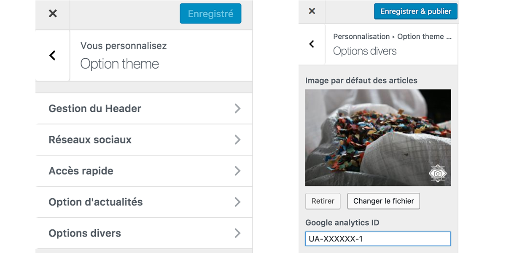

# Easy wordpress theme customizer

## How to use ?

Import local librairie in `functions.php` of your theme and declare customizer class:
```php
require_once 'class/theme_customizer.php';

add_action( 'customize_register' , array( 'YourTheme_Customizer' , 'register' ) );
```

Edit your class to add sections and elements

## Result
